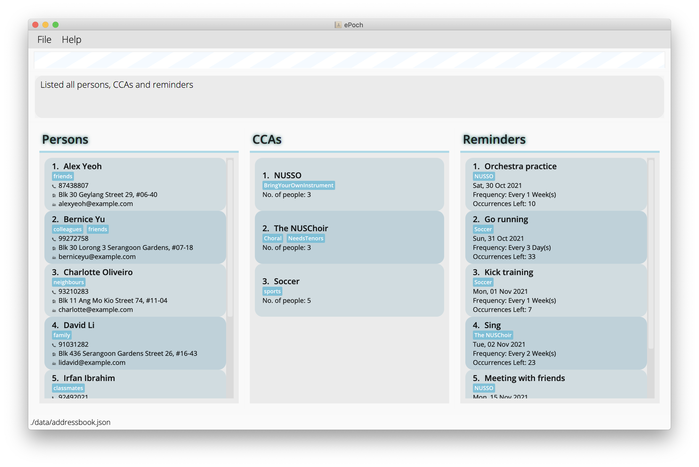

ePoch is a **desktop app for managing contacts, optimized for use via a Command Line Interface** (CLI) while still having the benefits of a Graphical User Interface (GUI). If you can type fast, ePoch can get your contact management tasks done faster than traditional GUI apps.

It has been designed for the busy NUS student. It allows the user to create contacts for persons and to create CCAs, link those persons and CCAs together, and to create periodic reminders for those CCAs.

It is built off of AB3, and contains additional functionality over AB3.

* Table of Contents
{:toc}

--------------------------------------------------------------------------------------------------------------------

## Quick start

1. Ensure you have Java `11` or above installed in your Computer.

1. Download the JAR file. **The download location will be confirmed later.**

1. Copy the file to the folder you want to use as the _home folder_ for your ePoch.

1. Double-click the file to start the app. The GUI similar to the below should appear in a few seconds. Note how the app contains some sample data. 
   

1. Type the command in the command box and press Enter to execute it. e.g. typing **`help`** and pressing Enter will open the help window. 
   Some example commands you can try:

   * **`list`** : Lists all persons, CCAs and reminders.

   * **`addp`**`n/Tan Wei Yang:` Adds a person named `Tan Wei Yang` to ePoch.

   * **`deletep`**`pid/3` : Deletes the person with id 3.

   * **`clear`** : Deletes all data (persons, CCAs, reminders) from ePoch.

   * **`exit`** : Exits the app.

1. Refer to the [Features](#features) below for details of each command.

--------------------------------------------------------------------------------------------------------------------

## Features

**:information_source: Notes about the command format:** 

* Words in `UPPER_CASE` are the parameters to be supplied by the user. 
  e.g. in `addp n/NAME`, `NAME` is a parameter which can be used as `addp n/John Doe`.

